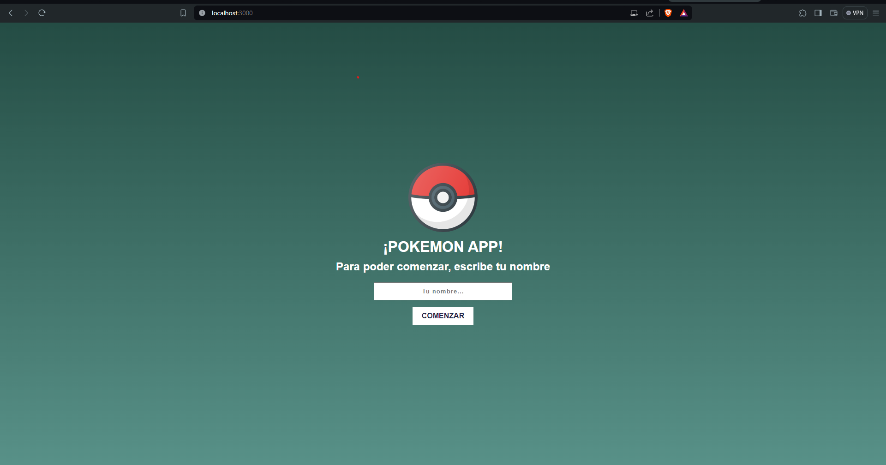
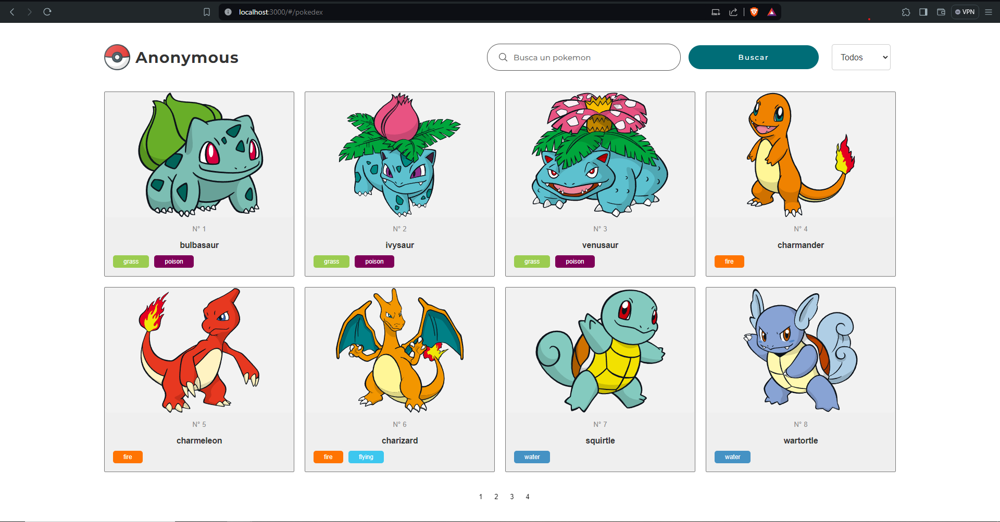
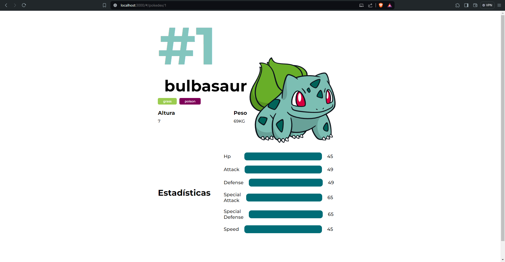

# Pokemon APP

El proyecto hecho en [React.js](https://es.react.dev/). Se muestra un catálogo de Pokémones haciendo uso de la api [PokeAPI](https://pokeapi.co/), se implementaron tecnologías de Hook para el manejo de estados y [Redux](https://redux.js.org/) para el guardado de información de forma global en la aplicación.

## Ejecución

Para correr el proyecto en su máquina local, descargue las librerías de **node_modules** con el comando

### `npm install`

Para correr la aplicación, ejecute

### `npm start`

Esto iniciará la aplicación en el puerto 3000, dirijae a la dirección [http://localhost:3000](http://localhost:3000) en su navegador.

## Pantallas

### Splash
Se le solicitará un nombre de usuario para ingresar.

### Home
Se listan los Pokemones con páginación, se cuenta con un campo de búsqueda y un dropdown para filtrar por categorías.

### Detalles
Información que se muestra por cada Pokémon.

